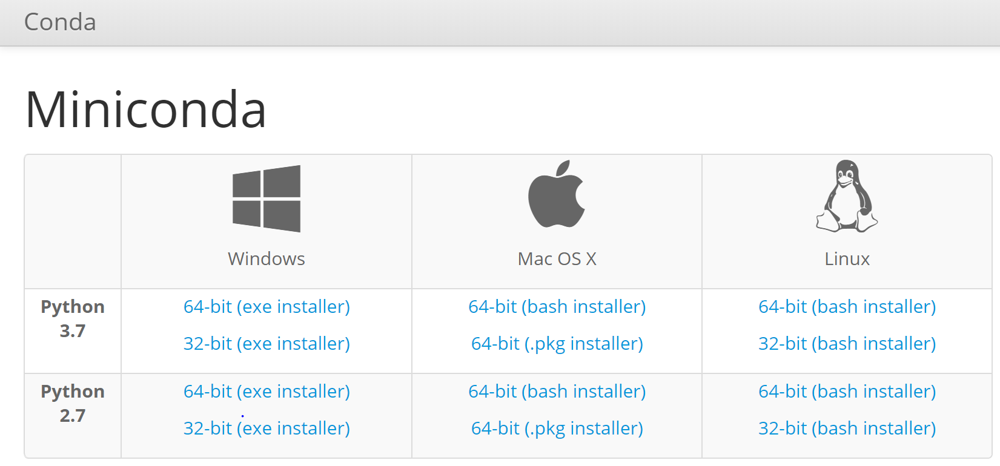
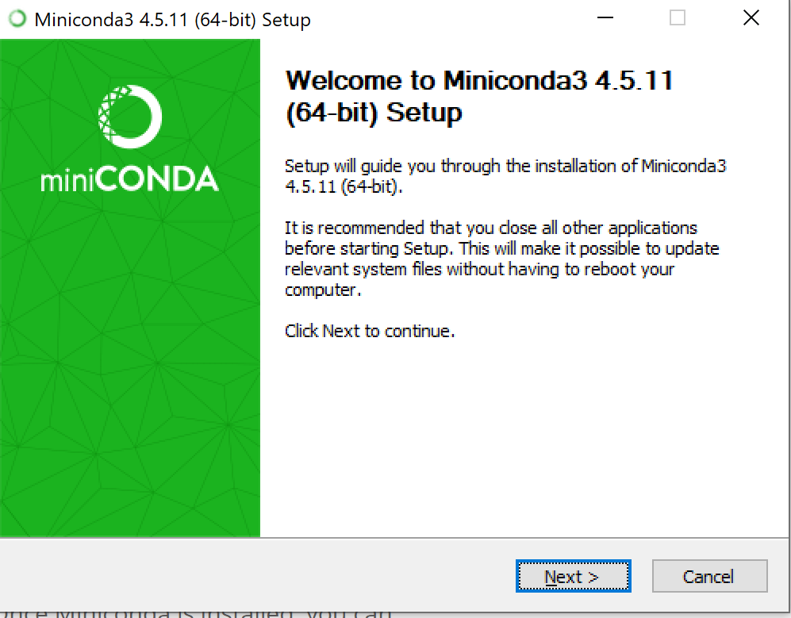
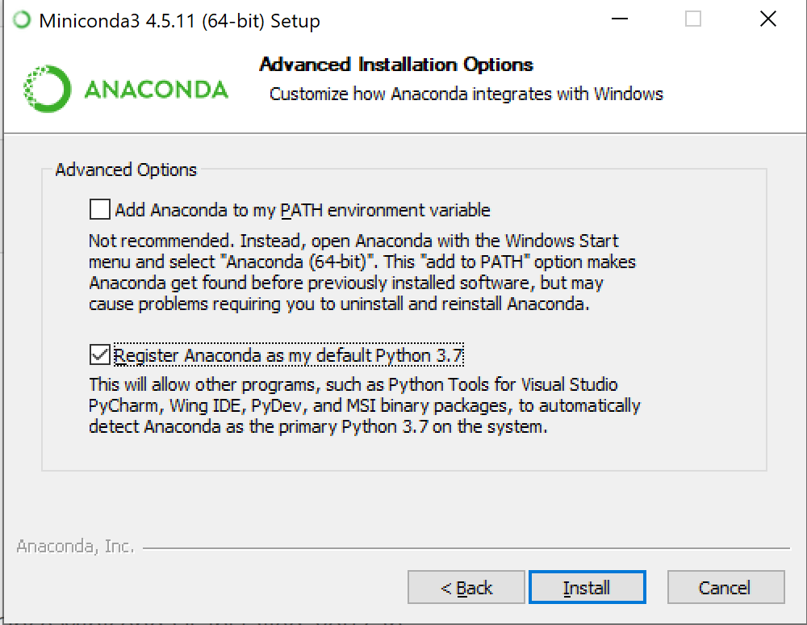

Programming Adventures with Python in Minecraft
=================================================

## Learn to Program in Minecraft!

Welcome to the Learn to Program in Minecraft workshop! During this workshop you'll write programs in Python to control your Minecraft world and character and create exciting adventures. 

Each day of class consists of instruction and two hands on labs. Participants will be grouped into teams of 5, and are encouraged to share and help each other with the lab and course work. 

## IMPORTANT: Local Setup

It is recommended that each participant bring her/his own Windows / MacOS computer and install python 2.7 and the Minecraft client by following the instructions below (Minecraft servers will be created by the instructor):

**NOTE: installation will take roughly ~30 minutes**. You should choose either to download miniconda or Anaconda. Miniconda only has a command line interface, whereas Anaconda has a full GUI interface. Either option works fine for the course, but if you're not comfortable with the command line, Anaconda will be easier to use (although is a much larger download, and at some point you will have to use the command line anyway :wink:).

1. Download the course materials as a zip file:
    - download the material using [the following link](https://github.com/akzaidi/minecraft_workshop/archive/master.zip)
    - unzip the folder using 7zip or the application of your choice (usually right click and extract)
        - you'll need an unzip application to extract the archive. You can use a program such as [7zip](https://www.7-zip.org/download.html)
2. Download [miniconda](https://conda.io/miniconda.html) from the following link:
    * miniconda: 
    * either Python 2.7 or 3.7 will work fine.
3. Follow the installer instructions:
    
    * for Windows, **don't** add Anaconda to your path:
    
4. Launch the conda prompt: 
    - If you're on Windows: search for `Anaconda Prompt` in your applications.
    - If you're on macOS, just open a terminal (spotlight -> terminal)
5. Navigate to the minecraft workshop client directory using the `conda` prompt
    ```bash
    cd minecraft_workshop/client_launcher [macOS/Ubuntu]
    chdir minecraft_workshop/client_launcher [Windows]
    ```
    - it might be `chdir minecraft_workshop-master/minecraft_workshop-master/client_launcher`, just double check in your file explorer what the name is of the directory and enter that in the prompt
6. Install the conda environment:
    ```bash
    conda env update -f environment.yml
    ```
7. Activate the environment:
    ```bash
    conda activate teachcraft
    ```
8. Start the minecraft client:
    ```bash
    python launcher.py
    ```
    * Make a note of the username you entered when prompted

The first time you run the launcher it will take some time. The following sessions should be quick.

If you have any questions, please post an issue [here](https://github.com/akzaidi/minecraft_workshop/issues) or contact the course staff.

## Day One - Setup and Movement

* **Accessing the Minecraft server using a client**
    - Overview of the Minecraft Server, client API, Spigot, and your Python environment
    - _Lab 1, getting started: Accessing labs from an editor and submitting Python code to our Minecraft server_
* **Defining and structuring variables for teleportation and flight** 
    - _Lab 2, build a house: Simple arithmetic for building complicated objects_
* **Chatting with Strings: Interacting with other players**
    - _Extra lab: Chatting with strings and running far_


****

## Day Two - Control Flow and Functions

* **Logical Operations and Control Flow**
    - _Lab 3, Zombie Escape! Using control for safe navigation during a Zombie apocolype_
* **Don't do it twice: functions as building blocks for reproducibility**
    - _Lab 4, Stairway to the sky: using functions to define reusable blocks for building staircases and buildings_

****

## Day Three - Loops and Recursion

To be posted.

## Additional Resources

- [miner](https://github.com/ropenscilabs/miner): R API for minecraft
    * [Book](https://github.com/ropenscilabs/miner): R Programming with Minecraft