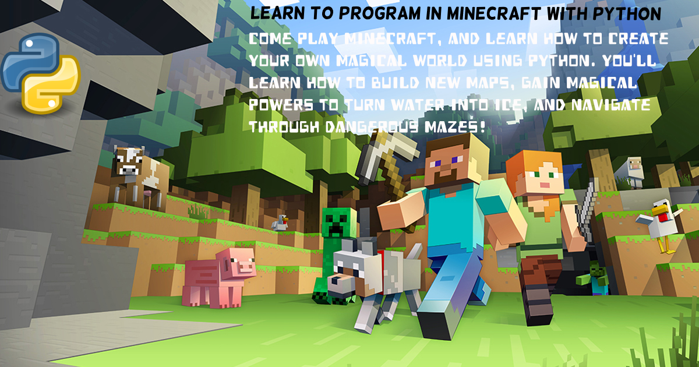

Programming Adventures with Python in Minecraft
=================================================

## Learn to Program in Minecraft!

Welcome to the Learn to Program in Minecraft workshop! During this workshop you'll write programs in Python to control your Minecraft world and character and create exciting adventures. 

Each day of class consists of instruction and two hands on labs. Participants will be grouped into teams of 5, and are encouraged to share and help each other with the lab and course work. 

## IMPORTANT: Local Setup

If you are bringing in your own computer, please follow the following steps to set up your client:

1. Download miniconda from [here](https://conda.io/miniconda.html)
1. Open a conda prompt and type 
    ```bash
    conda create -n teachcraft python=2.7
    ```
1. Clone or download the repository: 
    ```bash
    git clone https://github.com/akzaidi/minecraft_workshop.git
    ```
1. Navigate to the minecraft workshop using the prompt
    * On windows:
        ```bash
        chdir minecraft_workshop\TeachCraft-ClientLauncher
        python launcher.py
    * On macOS/Linux:
        ```bash
        cd minecraft/TeachCraft-ClientLauncher
        python launcher.py
        ```

The first time you run the launcher it will take some time. The following sessions should be quick.

If you have any questions, please post an issue [here](https://github.com/akzaidi/minecraft_workshop/issues) or contact the course staff.

## Day One - Setup and Movement

* **Accessing the Minecraft server using a client**
    - Overview of the Minecraft Server, client API, Spigot, and your Python environment
    - _Lab 1, getting started: using VSCode to edit and run Python code from your computer to your Minecraft server_
* **Defining and structruing variables for teleportation and flight** 
    - _Lab 2, build a house: Simple arithmetic for building complicated objects_
* **Chatting with Strings: Interacting with other players**


****

## Day Two - Control Flow and Functions

* **Logical Operations and Control Flow**
    - _Lab 3, Zombie Escape! Using control for safe navigation during a Zombie apocolype_
* **Don't do it twice: functions as building blocks for reproducibility**
    - _Lab 4, Stairway to the sky: using functions to define reusable blocks for building staircases and buildings_

****

## Day Three - Loops and Recursion


* **For loops**
    - _Lab 6, Pyramids of Giza: Building multiple pyramids of different sizes using for loops_
